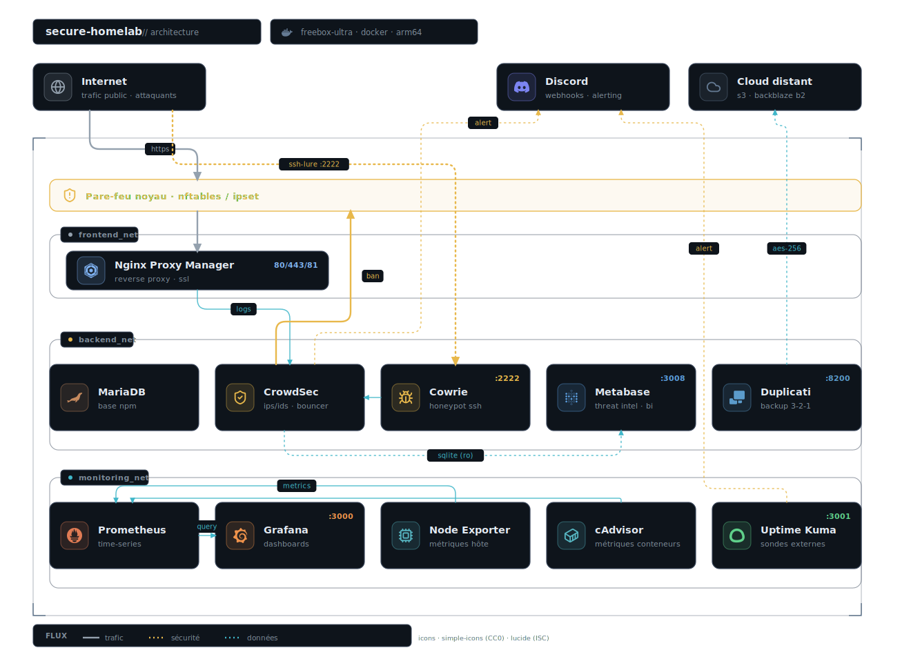

# Secure & Monitored Homelab Infrastructure

Ce projet documente la mise en place d'une infrastructure de homelab auto-hébergée, robuste et sécurisée. L'objectif est de déployer des services conteneurisés tout en garantissant une haute sécurité (IPS/IDS), une défense active, une observabilité complète (monitoring, alerting, BI) et une stratégie de sauvegarde résiliente.

## Architecture



<sub>Icônes : [Simple Icons](https://simpleicons.org) (CC0) et [Lucide](https://lucide.dev) (ISC).</sub>

## Stack technique

| Domaine | Composant | Rôle |
| --- | --- | --- |
| Infrastructure hôte | Freebox Ultra | Support VM ARM64 / Debian Bookworm |
| Conteneurisation | Docker Engine & Docker Compose | Déploiement unifié et reproductible |
| Orchestration | Portainer CE | Gestion graphique des stacks |
| Reverse proxy & SSL | Nginx Proxy Manager | Gestion automatique des certificats Let's Encrypt |
| Sécurité défensive (IPS/IDS) | CrowdSec | Agent d'analyse + bouncer pare-feu `nftables` |
| Défense active (honeypot) | Cowrie | Pot de miel SSH/Telnet haute interaction |
| Monitoring technique | Prometheus, Grafana, cAdvisor, Node Exporter | Métriques système et conteneurs |
| Business Intelligence | Metabase | Cartographie des menaces (connecté à la base CrowdSec) |
| Disponibilité | Uptime Kuma | Monitoring HTTP/TCP/DNS externe |
| Sauvegarde & résilience | Duplicati | Stratégie 3-2-1 avec chiffrement |
| Alerting | Discord Webhooks | Notifications centralisées en temps réel |

## Focus sécurité et défense active

La sécurité est le cœur de cette infrastructure, qui passe d'une posture passive à une défense proactive.

- **Analyse comportementale** : CrowdSec analyse en temps réel les logs de Nginx Proxy Manager et du système pour détecter les patterns d'attaques connus.
- **Honeypot SSH (Cowrie)** : un leurre est déployé sur un port secondaire (2222, redirigé depuis l'extérieur). Il simule un serveur vulnérable pour attirer les bots, enregistrer leurs commandes et détourner les attaques brute-force du véritable service SSH.
- **Stratégie « Sniper »** : un scénario CrowdSec ultra-agressif est appliqué spécifiquement aux logs du honeypot.
  - *Tolérance zéro* : bannissement immédiat et long (48 h) dès la 2e tentative d'intrusion échouée sur le pot de miel.
  - *Mémoire longue* : les tentatives sont mémorisées pendant 10 h, ce qui empêche d'échapper au ban en ralentissant la cadence de l'attaque.
- **Remédiation automatique** : le bouncer CrowdSec applique les bannissements directement au niveau du pare-feu du noyau Linux (`ipset` / `nftables`), bloquant l'IP avant même qu'elle n'atteigne les applications.
- **Gestion des accès** : whitelisting strict des IP locales et de confiance pour éviter les auto-bans.

## Observabilité et threat intel

Une stack complète surveille la santé du système et transforme les logs de sécurité en renseignement exploitable.

- **Prometheus** : collecte centrale des métriques système (CPU, RAM, I/O disque, réseau) et des performances Docker.
- **Grafana** : visualisation des données techniques via des dashboards personnalisés pour l'état de santé de l'hôte et des conteneurs.
- **Metabase (centre de threat intel)** : connecté en lecture seule à la base SQLite de CrowdSec, il sert de centre de commandement.
  - Cartographie mondiale des attaques bloquées en temps réel.
  - Identification des principaux pays, ASN et scénarios d'attaques les plus agressifs.
  - Analyse forensique de l'historique des tentatives d'intrusion.
- **Uptime Kuma** : surveille la disponibilité des services HTTP/TCP depuis l'extérieur et alerte instantanément via Discord en cas de downtime (vérification du bon fonctionnement du reverse proxy).

## Stratégie de sauvegarde

Pour garantir la pérennité des données, une stratégie de sauvegarde suivant la règle **3-2-1** est mise en place avec **Duplicati**.

- **Trois copies des données** : données « live » sur le serveur, plus deux sauvegardes.
- **Deux supports différents** :
  - Copie locale rapide (NAS local ou support USB attaché à la Freebox).
  - Copie distante (API cloud : S3, Backblaze B2 ou autre stockage compatible).
- **Une copie hors site** : la sauvegarde cloud garantit la survie des données en cas de sinistre physique (incendie, vol de la Freebox).
- **Sécurité des sauvegardes** : toutes les sauvegardes sortantes sont chiffrées en AES-256 par Duplicati avant l'envoi.

## Installation

Ce projet utilise `docker-compose` pour un déploiement unifié et reproductible.

1. Cloner le dépôt :

   ```bash
   git clone https://github.com/Jager-29/securehomelab.git
   cd securehomelab
   ```

2. Configurer l'environnement. Créez le fichier `.env` à partir de l'exemple, puis modifiez les mots de passe :

   ```bash
   cp .env.example .env
   nano .env
   ```

   Définissez des mots de passe forts pour `NPM_DB_PASSWORD` et `GRAFANA_PASSWORD`.

3. Préparer les dossiers. Créez les répertoires nécessaires pour éviter les problèmes de permission au démarrage (notamment pour le honeypot et Metabase) :

   ```bash
   mkdir -p cowrie/var/log/cowrie
   mkdir -p cowrie/etc
   mkdir -p metabase-data
   mkdir -p duplicati/config
   ```

4. Démarrer la stack en mode détaché :

   ```bash
   docker compose up -d
   ```

5. Corriger les permissions (nécessaire pour Metabase). Une fois CrowdSec démarré, il crée sa base de données SQLite. Donnez les droits de lecture à Metabase pour que le dashboard fonctionne :

   ```bash
   # Autoriser la lecture de la base CrowdSec par les autres conteneurs
   sudo chmod 644 crowdsec/db/crowdsec.db
   # Redémarrer Metabase pour qu'il prenne en compte le changement
   docker restart metabase
   ```

## Accès aux services

Une fois déployé, voici les ports d'accès par défaut (à configurer via Nginx Proxy Manager pour un accès externe sécurisé).

| Service | Port local | URL locale | Identifiants par défaut |
| --- | --- | --- | --- |
| Nginx Proxy Manager | 81 | `http://IP_LOCALE:81` | `admin@example.com` / `changeme` |
| Grafana | 3000 | `http://IP_LOCALE:3000` | `admin` / (valeur du `.env`) |
| Uptime Kuma | 3001 | `http://IP_LOCALE:3001` | Création de compte au 1er lancement |
| Metabase (BI) | 3008 | `http://IP_LOCALE:3008` | Setup au 1er lancement |
| Duplicati (backup) | 8200 | `http://IP_LOCALE:8200` | Pas de mot de passe par défaut |
| Cowrie (honeypot) | 2222 | Port SSH leurre | Ne pas exposer l'interface, c'est un piège |

## Configuration initiale requise

**Nginx Proxy Manager** : connectez-vous, changez les identifiants admin, puis créez vos Proxy Hosts.

**CrowdSec** : le bouncer est déjà configuré. Vous pouvez gérer les décisions via :

```bash
docker exec -it crowdsec cscli decisions list
```

**Metabase** : ajoutez la base de données CrowdSec.

- Type : SQLite.
- Chemin du fichier : `/crowdsec-db/crowdsec.db` (chemin interne au conteneur).

## Licence

Distribué sous licence MIT. Voir le fichier [LICENSE](LICENSE) pour plus de détails.
